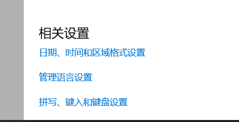

# 终端

## 1.设置win10的编码格式为utf-8，解决中文乱码问题

**问题**：终端键入 `chcp`，得到的结果不是65001（utf-8的编码格式）

**解决方案：**

1. 暂时解决：终端键入 `chcp 65001`，缺点是关闭终端后恢复原样。

2. 桌面右键点击设置，搜索语言，点击 ：**管理语言设置**

点击：**更改系统区域设置**，点击：**Beta版：使用Unicode UTF-8**

点击：**重启电脑**。

## 2.Git的安装windows系统

